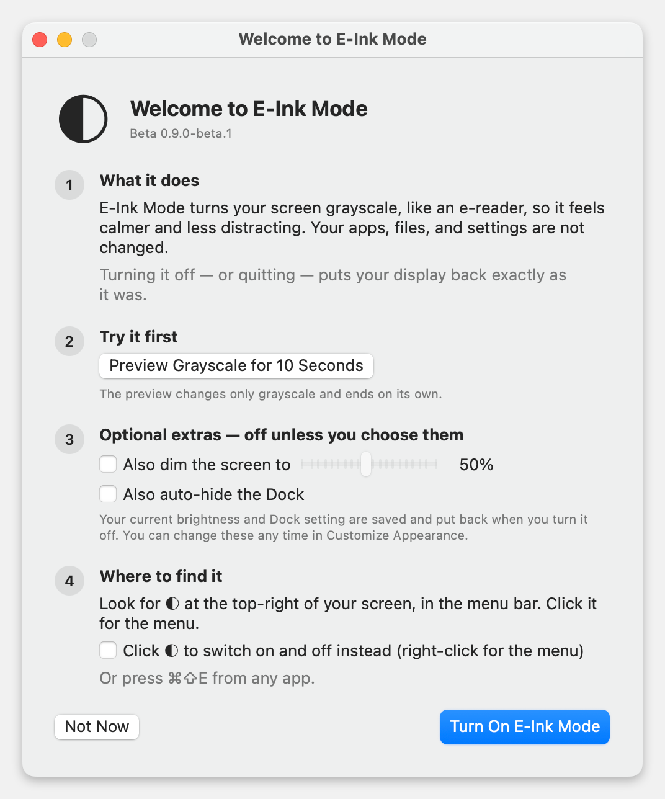
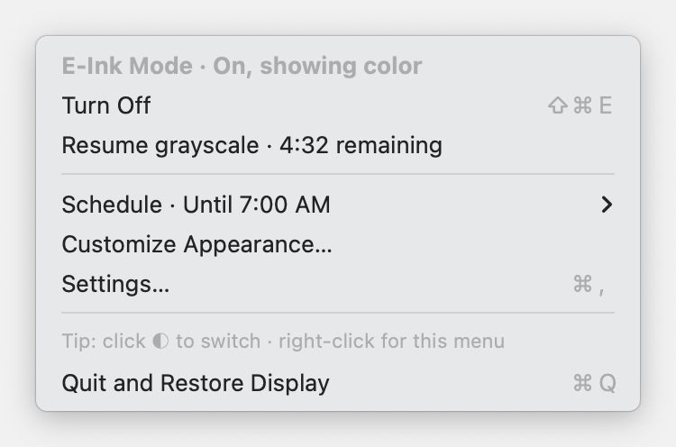
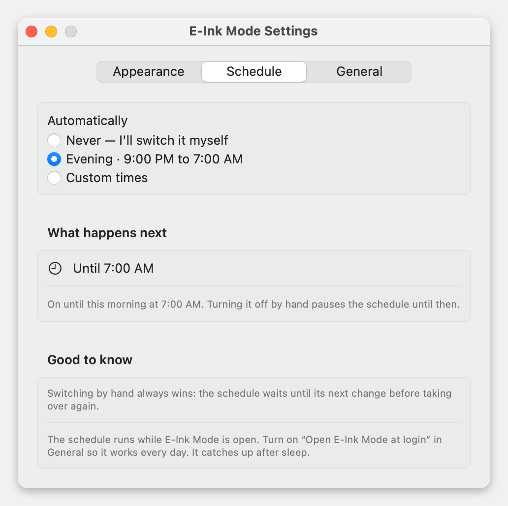
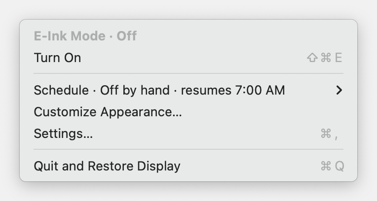
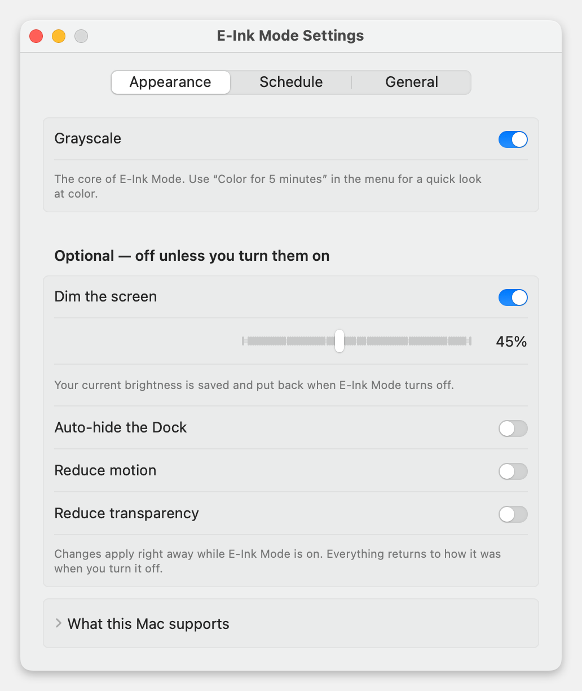
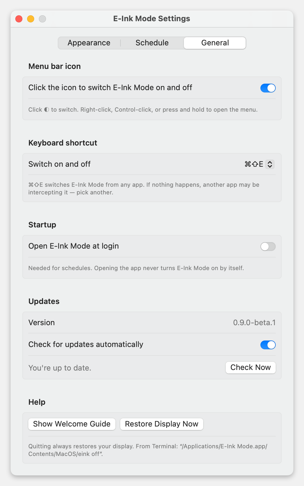

<p align="center"></p>

<h1 align="center">E-Ink Mode</h1>

<p align="center"><b>A calmer, grayscale Mac: one click away, and always reversible.</b><br>
A tiny menu bar app for macOS 13 Ventura or newer. Currently in <b>beta</b>.</p>

---

E-Ink Mode turns your screen grayscale, like an e-reader. Color is what makes notifications, badges, and feeds grab your attention; without it, your screen feels quieter and it's easier to stay on one thing. When you need color, take it back for five minutes. When you turn E-Ink Mode off, **your display returns exactly as it was.**

- [Install](#install)
- [First launch](#first-launch)
- [Everyday use](#everyday-use)
- [Color for 5 minutes](#color-for-5-minutes)
- [Evening schedule](#evening-schedule)
- [Customize appearance](#customize-appearance)
- [Settings](#settings)
- [Your display always comes back](#your-display-always-comes-back)
- [Updating and uninstalling](#updating-and-uninstalling)
- [Privacy](#privacy) · [Limitations](#known-limitations) · [FAQ](#faq) · [For developers](#for-developers)

## Install

**Easiest:** open **Terminal** (press ⌘-Space, type *Terminal*, press Return), paste this line, and press Return:

```sh
curl -fsSL https://github.com/marcveihl/eink-mode/releases/latest/download/install.sh | bash
```

The script downloads the latest version, checks it, quits any older copy (restoring your display first), moves the app into **Applications**, and opens it. Look for **◐** in the menu bar at the top-right of your screen.

<details>
<summary><b>Prefer to download the zip yourself?</b></summary>

1. Download `E-Ink-Mode-<version>.zip` from the [latest release](https://github.com/marcveihl/eink-mode/releases) and double-click it to unzip.
2. Drag **E-Ink Mode** into your **Applications** folder.
3. Double-click it. Because this beta isn't notarized by Apple yet, macOS will say it *can't verify* the app. Click **Done** (or **OK** on older macOS), not *Move to Trash*.
4. Open **System Settings → Privacy & Security**, scroll down, and click **Open Anyway** next to *"E-Ink Mode" was blocked*. Confirm with your password.

You only do this once. Later updates install from inside the app.
</details>

If you open the app from Downloads, it offers to **move itself into Applications**. Say yes: launch-at-login and updates work reliably only from there. If you open the app while it's already running, the running copy shows you where it lives instead of starting a second one. If the two copies are different versions, you choose which one to keep.

## First launch

A short welcome guide explains what will change **before** anything changes.

<p align="center"></p>

1. **What it does:** grayscale only. Your apps, files, and settings stay the same.
2. **Try it first:** *Preview Grayscale for 10 Seconds* shows the effect and switches back on its own.
3. **Optional extras:** dimming the screen and auto-hiding the Dock are **off** unless you tick them. Your current brightness and Dock setting are saved and put back.
4. **Where to find it:** the ◐ icon in the menu bar. You can also choose to switch modes with a single click on the icon.

Choose **Turn On E-Ink Mode**, or **Not Now** to decide later. You can reopen the guide any time from **Settings → General → Show Welcome Guide**.

## Everyday use

Click **◐** in the menu bar. The mode and the main switch come first, and everything else sits below.

<p align="center"></p>

| Menu item | What it does |
|---|---|
| **E-Ink Mode · On / Off** | The current state at a glance. |
| **Turn On / Turn Off** | The main switch. **⌘⇧E** does the same from any app. |
| **Color for 5 Minutes** | Brings color back briefly, then returns to grayscale by itself. |
| **Schedule · …** | What the schedule will do next, such as *Until 7:00 AM* or *Turns on tonight at 9:00 PM*. |
| **Customize Appearance…** | Grayscale, dimming, Dock, motion, and transparency. |
| **Settings…** | Click behavior, keyboard shortcut, login, and updates. |
| **Quit and Restore Display** | Puts everything back and closes the app. |

The icon shows the state: **◐** off, **●** on, **◌** temporarily in color, and **!** when something needs your attention.

**Prefer one click?** Turn on *Click the icon to switch* (in the welcome guide or **Settings → General**). A quick click then toggles E-Ink Mode, and **right-click**, **Control-click**, or **press and hold** opens the menu. A reminder appears at the bottom of the menu.

## Color for 5 minutes

Checking a photo, a chart, or a color-coded calendar? Choose **Color for 5 Minutes**. Only grayscale is lifted; dimming, the Dock, and your other choices stay as they are. The menu counts down, and you can go back early with one click.

<p align="center"></p>

When time is up, grayscale returns automatically, even if your Mac was asleep in the meantime. Your saved settings are never changed by temporary color.

## Evening schedule

Let E-Ink Mode turn on in the evening and off in the morning. Pick **Schedule → Evening · 9:00 PM – 7:00 AM** from the menu, or choose your own times in **Settings → Schedule**.

<p align="center"></p>

- **You can always predict it.** The menu and settings say what happens next in plain words: *Turns on tonight at 9:00 PM*, *Until 7:00 AM*.
- **Switching by hand always wins.** If you turn it off during the evening, the schedule leaves it off until its next change, and the menu says so: *Off by hand · resumes 7:00 AM*.

  
- **It catches up** after your Mac wakes from sleep. After a restart or logout, it picks up the current period again when the app reopens.
- The schedule runs while the app is open. Turn on **Open E-Ink Mode at login** so it works every day. Opening the app never turns E-Ink Mode on by itself.

## Customize appearance

Everything beyond grayscale is optional and **off by default**. Changes apply immediately while E-Ink Mode is on, and each one goes back to its original value when you turn E-Ink Mode off.

<p align="center"></p>

| Option | Notes |
|---|---|
| **Grayscale** | The core effect. |
| **Dim the screen** | Sets your chosen brightness while on. Works on built-in and Apple displays. Other external monitors keep their own controls. |
| **Auto-hide the Dock** | Hides the Dock until you move the pointer to it. |
| **Reduce motion / transparency** | macOS accessibility options. Greyed out if your Mac doesn't support them. |

*What this Mac supports* lists anything your Mac can't control.

## Settings

<p align="center"></p>

- **Menu bar icon:** choose whether a click opens the menu or switches the mode.
- **Keyboard shortcut:** ⌘⇧E by default. Choose ⌃⌥⌘E, ⌃⌥E, ⌃⌥⌘G, or none. If another app already uses the shortcut, the app says so right there, so you can pick a different one.
- **Open E-Ink Mode at login:** needed for schedules. macOS may ask you to approve it in *System Settings → General → Login Items*.
- **Updates:** shows your **version** and checks for new versions automatically. When an update is available, it also appears in the menu. **Install and Relaunch** restores your display, installs the update, and reopens the app, back on if it was on.
- **Help:** reopen the welcome guide, or **Restore Display Now**.

## Your display always comes back

Changing someone's screen needs to be trustworthy. E-Ink Mode records your original settings on disk **before** it changes anything, and it only uses settings it can read back and restore.

| When you… | What happens |
|---|---|
| Turn it off, press the shortcut, or choose **Quit and Restore Display** | Every setting it changed goes back to its exact original value, one display at a time. |
| Log out, restart, or shut down | Your display is restored first. |
| Update the app | Your display is restored before the update is installed. |
| The app crashes or is force-quit | Next time it opens, it asks: **Restore Display** or **Continue Session**. |
| Something can't be restored (for example, a monitor was unplugged) | The app stays open and tells you why. Reconnect the monitor and choose **Restore Display** or **Try Again**. It won't quit and forget your originals. |
| Grayscale was already on before you started | It stays on. E-Ink Mode never turns off settings it didn't turn on. |

**Emergency switch:** in Terminal, run `"/Applications/E-Ink Mode.app/Contents/MacOS/eink" off`. You can also turn grayscale off yourself in *System Settings → Accessibility → Display → Color Filters*.

## Updating and uninstalling

**Update:** use **Settings → General → Check Now** (or the *Update Available* menu item), or re-run the install command.

**Uninstall:**
1. Choose **Quit and Restore Display** from the menu.
2. Drag **E-Ink Mode** from Applications to the Trash.
3. Optional, to remove saved preferences, run in Terminal:
   ```sh
   rm -rf ~/Library/Application\ Support/E-Ink\ Mode && defaults delete local.eink.mode
   ```

## Privacy

E-Ink Mode has no accounts, analytics, or tracking. The only network request is the update check, which reads the public release list from GitHub. You can turn it off in Settings. Your settings stay on your Mac in `~/Library/Application Support/E-Ink Mode/`.

## Known limitations

- **Beta signing:** this beta isn't notarized by Apple yet, so a manual download needs the one-time *Open Anyway* step. The install command avoids this.
- **Warm colors:** use Night Shift or f.lux. E-Ink Mode leaves warmth to them.
- **Notifications:** E-Ink Mode doesn't change Focus or Do Not Disturb, because macOS gives apps no reliable way to restore them.
- **Brightness** works only on displays that let macOS control it.
- **Schedules** need the app to be running (turn on *Open at login*).

## FAQ

**Is this the same as the grayscale color filter in Accessibility settings?** It uses the same macOS grayscale, plus one-click switching, temporary color, schedules, optional extras, and guaranteed restoration.

**Will it fight with my own accessibility settings?** No. It records what you had and puts that back, including settings that were already on.

**I don't see the icon.** Your menu bar may be full. Hide a few other icons, or use the shortcut **⌘⇧E**. Opening the app again from Applications also points to it.

**Does it slow down my Mac?** No. It changes a few system settings, then waits. It doesn't process your screen.

## For developers

Requires Xcode command-line tools (Swift 5.9+) and Python 3 for the CLI tests. No third-party dependencies.

```sh
./scripts/test.sh     # 47 core tests + process-level CLI tests against a simulated system
./scripts/build.sh    # universal app + dist/E-Ink-Mode-<VERSION>.zip + install.sh
```

The version comes from [`VERSION`](VERSION). Set `EINK_SIGN_IDENTITY` (Developer ID Application) and `EINK_NOTARY_PROFILE` (a `notarytool` keychain profile) to produce a signed, notarized build. See [docs/RELEASING.md](docs/RELEASING.md).

The app bundles a CLI with the same controls, sharing the same saved settings and recovery record:

```sh
eink status | on | off | toggle | version
eink color [minutes]      # temporary color (default 5), then back to grayscale
eink grayscale            # end temporary color now
eink set grayscale|dock|motion|transparency on|off
eink set brightness 5..100|unchanged
eink set schedule evening|on|off
eink set schedule-on|schedule-off HH:MM
```

`EINK_HOME` selects an isolated state directory, and `EINK_SIMULATED=1` changes a simulated system instead of your display. `EinkBar --qa-snapshots <dir>` (simulated only) renders the screenshots in this README.

More: [beta testing guide](docs/BETA-TESTING.md) · [QA checklist](docs/QA.md) · [changelog](CHANGELOG.md) · [original PRD](docs/PRD.md) · [implementation scope](docs/IMPLEMENTATION.md). The first prototype is preserved in `prototype0/`.
