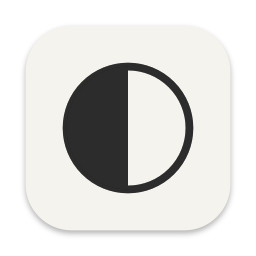
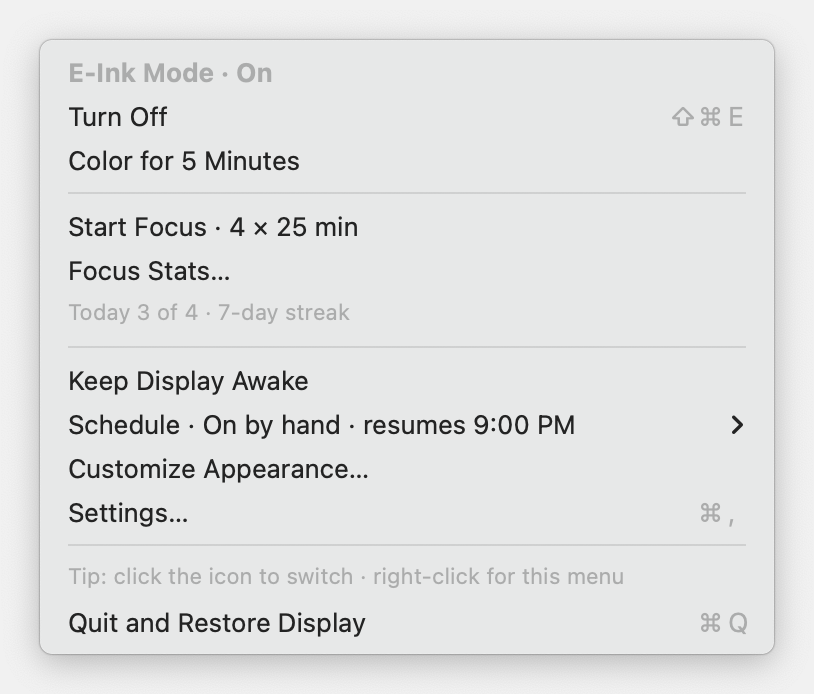
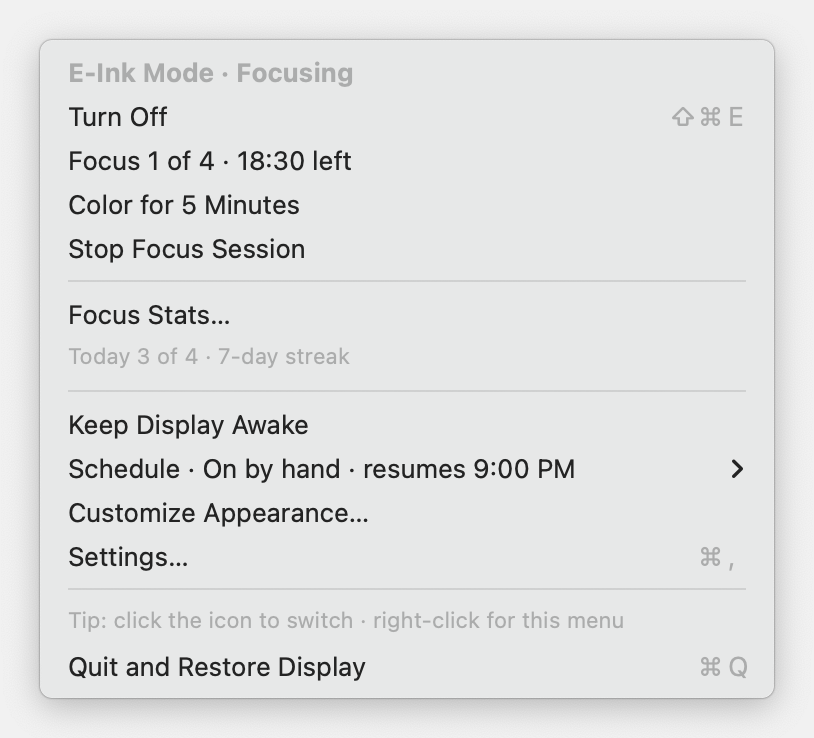
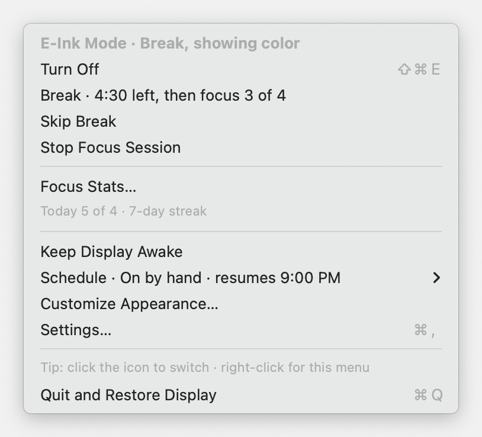
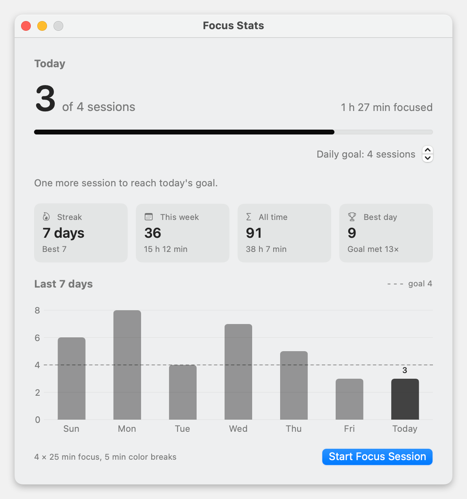
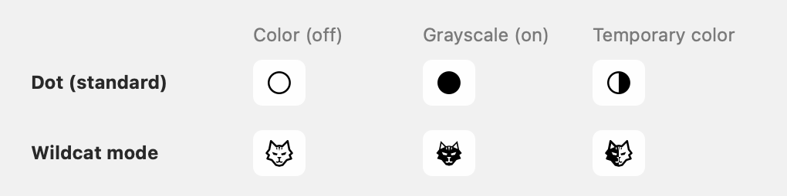

<p align="center"></p>

# E-Ink Mode

**A quieter Mac in one click.** Switch to grayscale, take a short color break, or run timed focus sessions from your menu bar.

For macOS 13 Ventura or newer · Apple silicon and Intel · **Beta**

[Download](https://github.com/marcveihl/eink-mode/releases/latest) · [User guide](docs/USER-GUIDE.md) · [Changelog](CHANGELOG.md) · [Roadmap](docs/ROADMAP.md)

<p align="center"></p>

## What it does

Color is what makes badges, feeds, and notifications pull at your attention. E-Ink Mode switches your Mac to grayscale, like an e-reader, so the screen fades into the background and the work comes forward. It's one click to turn on, and turning it off puts your display back exactly as it was.

### One-click grayscale

Switch from the menu bar or with **⌘⇧E** from any app. Grayscale is the only thing that changes by default. You can also opt in to dimming the screen, hiding the Dock, or reducing motion and transparency. A 10-second preview on first launch shows the effect before you commit.

### Color for 5 minutes

Need to check a photo, a chart, or a color-coded calendar? **Color for 5 Minutes** brings color back briefly, then returns to grayscale on its own. A countdown in the menu shows how long is left, and your other settings stay as they are.

### Focus sessions for studying

**Start Focus** runs a round of Pomodoro-style sessions: 25 minutes in grayscale to get into the work, then a 5-minute color break, four times over. The switches happen automatically, a soft sound marks each change, and a countdown sits next to the menu bar icon. You can skip a break, stop early (minutes you already focused still count), or take a quick color peek without pausing the timer.

<p align="center">
  
  
</p>

### A daily tracker that keeps you going

**Focus Stats** shows today's sessions against a daily goal (4 by default, and you can change it). It also shows your current and best streak, this week, all time, and your best day, with a 7-day chart and a short nudge suited to the moment, like *One more session to reach today's goal*. Your history stays on your Mac.

<p align="center"></p>

### An icon you can read at a glance

The menu bar icon is **unshaded** while your screen is in color, **shaded** while it's grayscale, and **half-shaded** during temporary color (a color peek or a focus break). **Wildcat mode** swaps the dot for a wildcat head that follows the same rule. Go 'Cats!

<p align="center"></p>

### And the rest

- **Keep Display Awake:** a switch in the menu that stops the display sleeping and the screen saver starting while you read. It lasts until you switch it off, and quitting always releases it.
- **Evening schedule:** turn on at 9 PM and off at 7 AM (or your own times). The menu tells you what's next, such as *Turns on tonight at 9:00 PM*, and switching by hand always wins.
- **Your display always comes back:** your original settings are saved before anything changes. Quitting, logging out, updating, and even a crash all lead back to exactly how your Mac looked before.
- **Updates built in:** the app checks for new versions and installs them in place.

See the [user guide](docs/USER-GUIDE.md) for every control, setting, and guarantee in detail.

## Install

Download the ZIP from the [latest release](https://github.com/marcveihl/eink-mode/releases/latest), unzip it, and move **E-Ink Mode.app** to **Applications**.

This beta is not yet notarized. If macOS blocks the app, use **System Settings → Privacy & Security → Open Anyway** after attempting to open it.

Prefer Terminal? Review the [installer](scripts/install.sh), then run:

```sh
curl -fsSL https://github.com/marcveihl/eink-mode/releases/latest/download/install.sh | bash
```

The installer downloads and installs the app and removes its quarantine attribute. In-app updates are available under **Settings → General**.

## Use

Click the **○** in the menu bar (it becomes **●** while your screen is grayscale) to turn the mode on, start a focus session, or change settings.

- Enable **Click the icon to switch** for one-click toggling. Right-click, Control-click, or hold to open the menu.
- Choose **Color for 5 Minutes** when you need color; **Resume grayscale** ends it early.
- Enable **Open at login** if you want the schedule to run each day.
- Choose **Quit and Restore Display** before uninstalling.

See the [user guide](docs/USER-GUIDE.md) for focus controls, stats, shortcuts, Wildcat icons, and troubleshooting.

## Privacy and limitations

Settings and focus history stay on your Mac. There are no accounts or analytics. Update checks and downloads contact GitHub; automatic checks can be disabled.

The app saves your original display settings for restoration. After a crash, it offers recovery on the next launch. Disconnected displays may need reconnecting before restoration can finish.

Brightness support varies by display. Night Shift, f.lux, and notification settings are managed separately. Schedules require the app to be running. Focus stats record elapsed timer sessions, including catch-up after sleep—not measured attention.

## Build

Requires Xcode command-line tools with Swift 5.9+ and Python 3. No third-party dependencies.

```sh
./scripts/test.sh
./scripts/build.sh
```

[CLI reference](docs/USER-GUIDE.md#for-developers) · [Release guide](docs/RELEASING.md) · [Beta testing](docs/BETA-TESTING.md) · [QA checklist](docs/QA.md)
